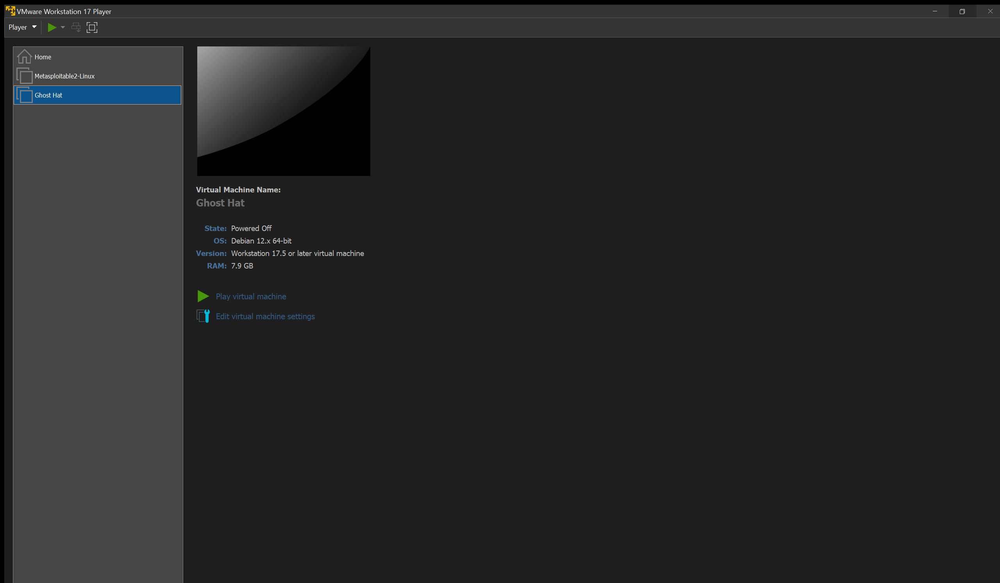
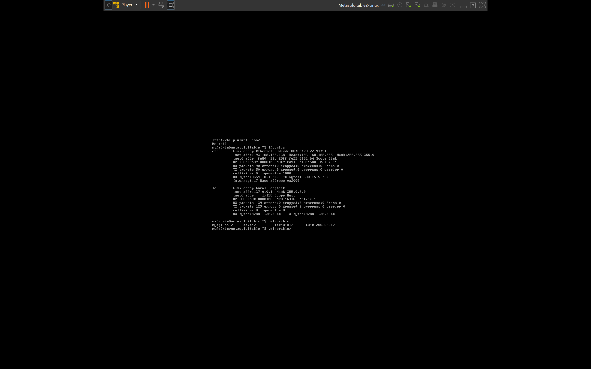
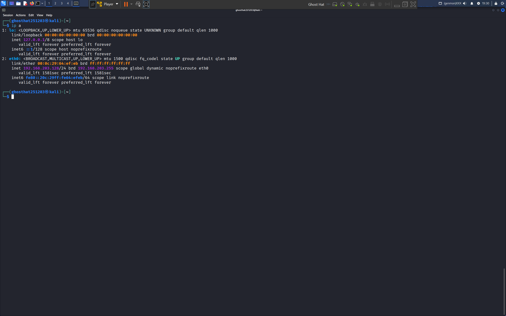
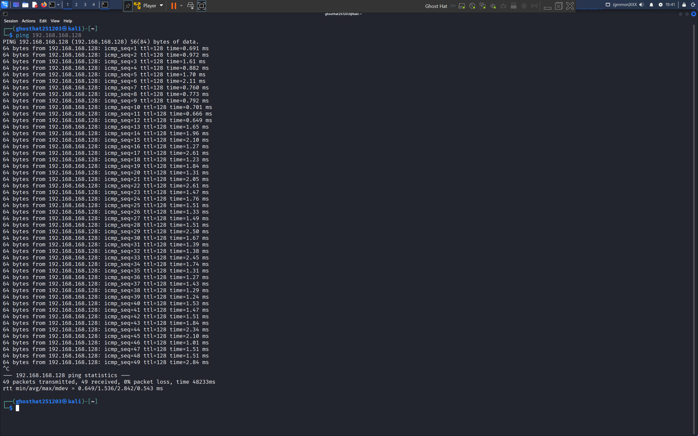
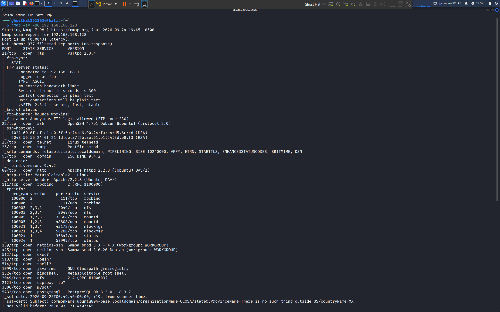
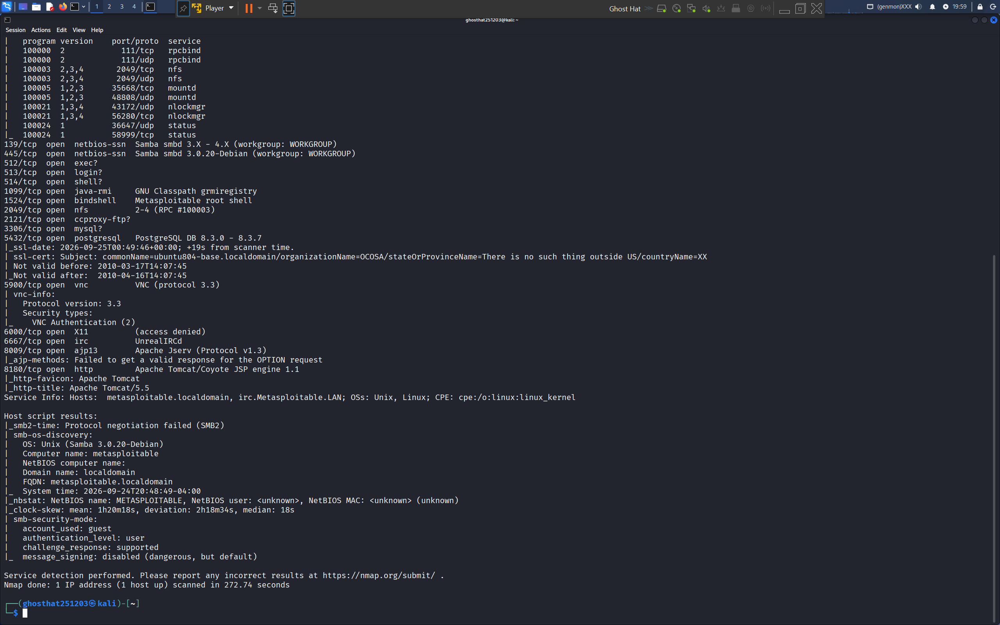

# Lab 1: Setting Up My Cybersecurity Home Lab

Today, I finally set up my very first local cybersecurity lab using VMware Workstation Player. My main goal was to build a safe, isolated environment where I can practice penetration testing without touching the outside internet.

## 1. Environment Overview
To make this work, I used:
* **Host Machine:** Windows 
* **Hypervisor:** VMware Workstation Player
* **Attacker VM:** Kali Linux
* **Target VM:** Metasploitable 2

Here is a quick look at my hypervisor library with both virtual machines ready to roll:

## 2. Network Configuration & Verification
I set both virtual machines to use a **Host-Only** network configuration so they can talk to each other on a private virtual switch away from the main network.

First, I booted up Metasploitable 2, logged in, and ran `ifconfig` to check its network settings and grab its IP address.

* **Target IP Address:** `192.168.168.128`

Next, I jumped into Kali Linux, checked my interfaces with `ip a`, and tested out the connection by pinging the target. Seeing that zero-packet loss gave me immediate confirmation that my attacker machine was successfully talking to the target!

## 3. Initial Reconnaissance (Nmap Scan)
To see what kind of services were running on the target, I ran an Nmap service version and default script scan against Metasploitable 2 using the command: nmap -sV -sC 192.168.168.128

Since the scan results are pretty long and detailed, I broke them down across two screenshots to keep everything clean and readable:

**Part 1: The early ports and core services (like FTP, SSH, HTTP, and SMB)**

**Part 2: The remaining ports (like VNC, Tomcat) and host script results**

### Key Takeaways from the Scan:
* The scan picked up a bunch of intentionally vulnerable services—like an old FTP version (vsftpd 2.3.4), SSH, and a web server.
* This gives me an awesome roadmap of attack surfaces to explore and practice exploiting in my upcoming labs!
